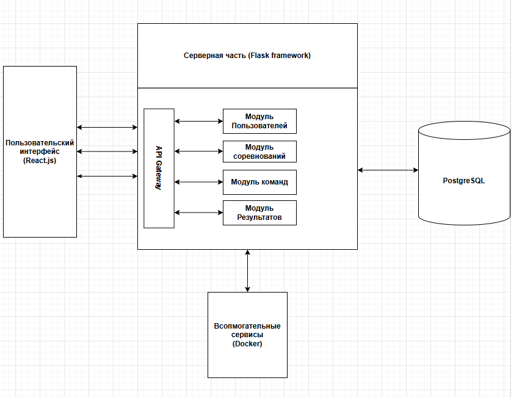
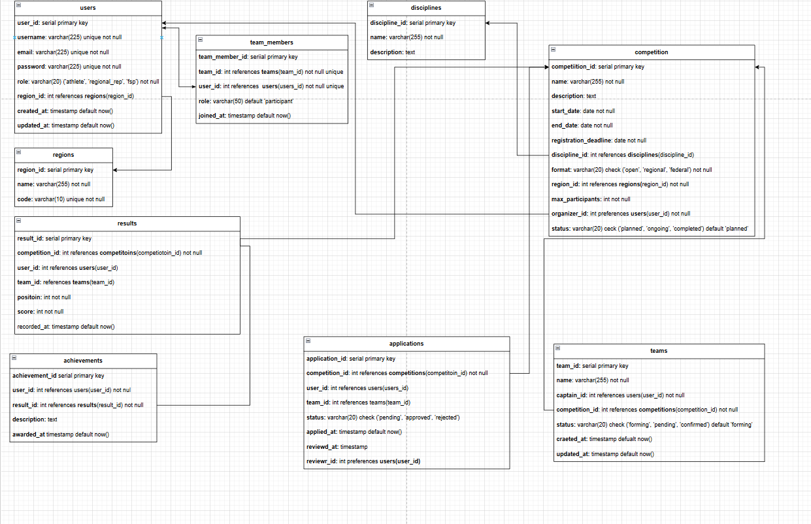

# Web Platform
MVP Платформа для автоматизации процессов ручного управления соревнованиями ФСП

# Технологии
- Frontend: HTML, CSS, JS, React.js
- Backend: Python, Flask, SQLalchemy
- СУБД: PostgreSQL, Alembic (для миграции)

PostgreSQL была выбрана по ряду причин, а именно:
- Поддержка ACID-транзакций для надежности операций
- Возможность использования JSONB для гибкого хранения дополнительных атрибутов
- Индексы GIN/GIST для ускорения поиска по текстовым полям

# Сценарии
- *Сценарий 1: Создание открытого соревнования:* Представитель ФСП создает соревнование с обязательными атрибутами: название, 
тип (открытое), дисциплина, даты (регистрация/проведение), описание, ограничения
(регион, максимальное количество спортсменов). Публикует соревнование, 
после чего оно отображается в общей ленте и в списке активных событий.
- *Сценарий 2: Регистрация команды в полном составе:* Капитан команды находит открытое для регистрации соревнование 
через фильтры (дата, формат, дисциплина, регион). Внутри соревнования 
создает команду, и вводит в поля участников их идентификационные 
номера (или предложите свой альтернативный вариант). В личном кабинете выбранных спортсменов, появляется приглашение 
взаимодействуя с которым они подтверждают присоединение. После чего система
автоматически подставляет необходимые данные в информацию об спортсмене 
в форму заявки на соревнование. После заполнения всех необходимых данных капитан
отправляет на модерацию командную заявку на соревнование. Система присваивает
статус «На модерации». Организатор подтверждает или отклоняет заявку

- *Сценарий 3: Регистрация команды с частичным составом:* Капитан создает команду на соревнование, оставляет свободные места и устанавливает статус «Требуются спортсмены». Указывает требуемые роли в описании. Команда отображается в списке формирующихся составов на странице соревнования.

- *Сценарий 4: Присоединение к команде:* Спортсмен выбирает открытое соревнование, просматривает списки утвержденных и формирующихся команд. Отправляет запрос капитану. Капитан принимает или отклоняет заявку. Утвержденный спортсмен добавляется в команду

- *Сценарий 5: Создание федерального соревнования с заявками от регионов:* Всероссийская Федерация спортивного программирования создает федеральное соревнование. Региональные представители подают заявки от своих регионов через раздел федеральных событий, заполняя уникальные идентификаторы (или предложите свой альтернативный вариант) ФСП проверяет и утверждает заявки, после чего команды включаются в список допущенных к участию.

- *Сценарий 6: Регистрация на региональное соревнований:* Региональный представитель создает соревнование с форматом «Региональное». Система автоматически назначает регион (на основе данных представителя). Также должна быть возможность создать межрегиональное соревнование (например между Санкт-Петербургом и Москвой). Спортсмены из других регионов не могут подать заявку — система отклоняет их автоматически. Спортсмены из указанного региона регистрируются без ограничений.

- *Сценарий 7: Индивидуальная регистрация:* Спортсмен просматривает информацию о текущих и завершенных соревнованиях. Выбирает событие с индивидуальным зачетом, заполняет необходимые данные и подает заявку.

- *Сценарий 8: Подведение итогов и обновление портфолио:* После завершения соревнования организатор распределяет места и вносит баллы спортсменов. Система автоматически обновляет профили спортсменов
и публикует результаты на странице события.

- *Сценарий 9: Личный профиль:* Спортсмен просматривает и редактирует данные личного профиля. Просматривает историю участия в соревнованиях, включая достижения и результаты. Подтверждает своё участие в команде на соревнованиях.

- *Сценарий 10: Аналитика достижений и соревнований:* Представитель ФСП просматривает и анализирует данные о текущих 
и прошедших соревнованиях, а также о зарегистрированных спортсменах, используя фильтры по дисциплине, региону, дате и статусу. Имеется возможность выгрузки данных в отдельном файле для работы.

## Архитектура Системы

### Взаимодействие
- Пользовательский интерфейс и серверная часть будут взаимодействовать по протоколу REST API (HTTPS)
- Серверная часть (Flask) будет взаимодействовать с PostgreSQL через запросы SQLalchemy

## Структура базы данных

Текстовое описание связей в базе данных:
1. users и regions (1:N): 
    - users.region_id (FK) → regions.region_id (PK).
    - Один регион может быть у многих пользователей.

2. competitions и disciplines (1:N)
    - competitions.discipline_id (FK) → disciplines.discipline_id (PK).
    - Одна дисциплина может быть у многих соревнований.

3. competitions и regions (1:N)
    - competitions.region_id (FK) → regions.region_id (PK).
    - Только для региональных соревнований.

4. teams и competitions (1:N)
    - teams.competition_id (FK) → competitions.competition_id (PK).
    - Одно соревнование может включать множество команд.

5. teams и team_members (1:N)
    - team_members.team_id (FK) → teams.team_id (PK).
    - Одна команда может иметь много участников.

6. team_members и users (N:M)
    - team_members.user_id (FK) → users.user_id (PK).
    - Таблица team_members является промежуточной для связи многие-ко-многим.

7. applications и competitions (1:N)
    - applications.competition_id (FK) → competitions.competition_id (PK).
    - Одно соревнование может иметь множество заявок.

8. applications и users (1:1 или N:1)
    - applications.user_id (FK) → users.user_id (PK).
    - Индивидуальные заявки: один пользователь → одна заявка.

9. applications и teams (1:1 или N:1)
    - applications.team_id (FK) → teams.team_id (PK).
    - Командные заявки: одна команда → одна заявка.

10. results и competitions (1:N)
    - results.competition_id (FK) → competitions.competition_id (PK).
    - Одно соревнование может иметь множество результатов.

11. results и users/teams (1:1 или N:1)
    - results.user_id (FK) → users.user_id (PK) — для индивидуальных результатов.
    - results.team_id (FK) → teams.team_id (PK) — для командных результатов.

12. achievements и results (1:1)
    - achievements.result_id (FK) → results.result_id (PK).
    - Одно достижение соответствует одному результату.

13. achievements и users (1:N)
    - achievements.user_id (FK) → users.user_id (PK).
    - Один пользователь может иметь множество достижений.